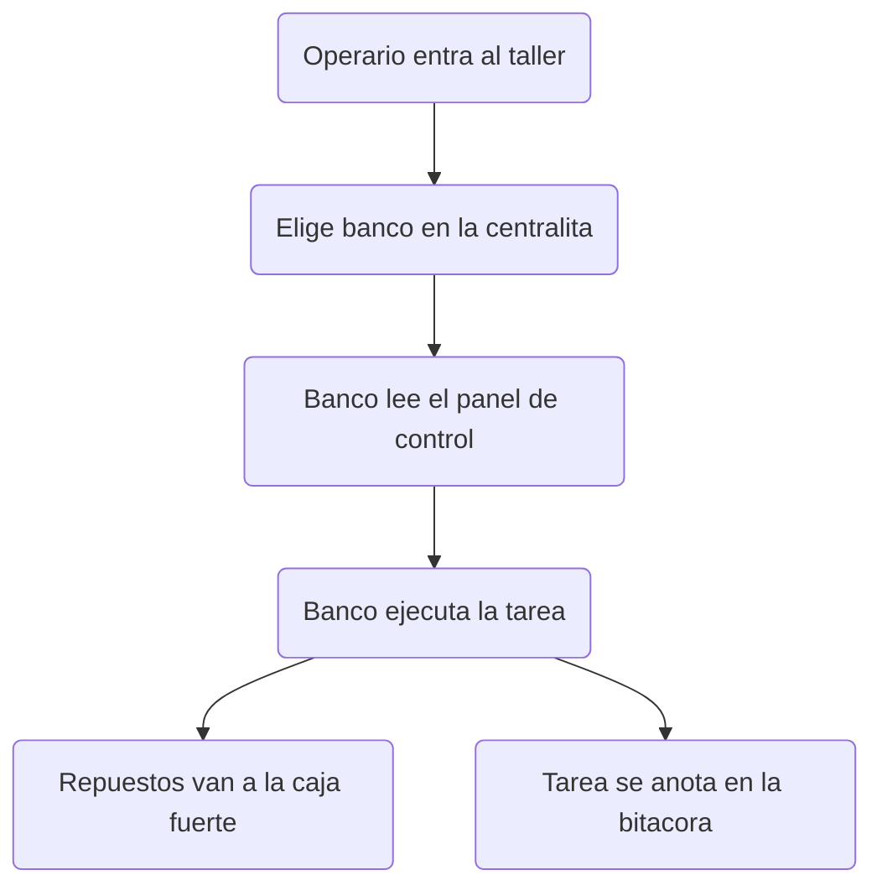
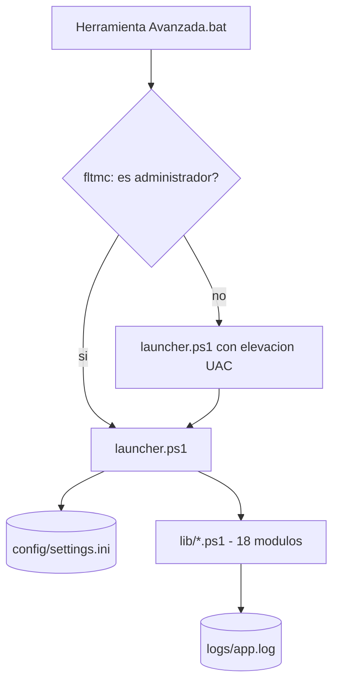

# Herramienta Avanzada v5.0

Suite portable de administracion de Windows en consola. Sin instalacion, sin dependencias externas, 18 modulos funcionales y 138 tests automatizados.

---

## 📌 Descripcion General

<!-- nota: analogia = taller mecanico → la suite es un taller, cada modulo es un banco de trabajo -->

Herramienta Avanzada es un <u style="color:#00E696">taller mecanico</u> para tu Windows: reparas, vigilas y organizas el equipo desde una sola consola. Abres un archivo y el taller entero queda a tu servicio, sin instalar nada.

## 🎯 Proposito y Beneficios

<!-- nota: analogia = taller mecanico → cada beneficio es una mejora concreta del taller -->

- **Portable:** corre desde una carpeta, sin instalar nada.
- **Seguro:** toda tarea delicada pide confirmacion antes de tocar algo.
- **Rapido:** cada tarea se resuelve desde un menu, sin ventanas de mas.
- **Legible:** menus en español y texto plano, sin tecnicismos a la vista.
- **Auditable:** cada accion queda anotada en el cuaderno de bitacora.

## 📊 Flujo de Datos

<!-- nota: analogia = taller mecanico → dos vistas del mismo taller -->

### Vista Conceptual (para el operario)

### Vista Arquitectonica (para el tecnico)

## ⚙️ Instalacion y Configuracion

<!-- nota: analogia = taller mecanico → montar el taller en 4 pasos -->

1. **Accion:** Descarga la carpeta de la suite y descomprimela. **Resultado:** el taller queda montado en un solo directorio.
2. **Accion:** Ejecuta `Herramienta Avanzada.bat` con clic derecho y "Ejecutar como administrador". El archivo comprueba tus permisos; si no eres administrador, Windows pedira confirmacion (UAC). **Resultado:** se abre el menu principal con la llave maestra.
3. **Accion:** (Opcional) Edita `config\settings.ini` para cambiar rutas, colores o el vaciado de DNS tras editar el hosts. **Resultado:** el taller recuerda tu preferencia en cada arranque.
4. **Accion:** (Opcional) Ejecuta las 3 suites de control de calidad. **Resultado:** confirmas que los 138 tests pasan antes de usar el taller a diario.

## 💻 Uso y Ejecucion (CLI)

<!-- nota: analogia = taller mecanico → el mando de la centralita -->

| Comando | Que hace (en el taller) |
| --- | --- |
| `Herramienta Avanzada.bat` | Abre la puerta del taller con permisos de administrador. |
| `powershell -NoProfile -ExecutionPolicy Bypass -File launcher.ps1` | Entra directo a la centralita sin la puerta de entrada. |
| `powershell -NoProfile -ExecutionPolicy Bypass -File test\Validate-Phase2.ps1` | Pasa el control de calidad interno (88 pruebas). |
| `powershell -NoProfile -ExecutionPolicy Bypass -File test\Functional-Tests.ps1` | Prueba el taller en tu maquina concreta (40 pruebas). |

## 📂 Estructura del Proyecto

<!-- nota: analogia = taller mecanico → mapa del taller -->

- **lib/:** [18 bancos de trabajo] — un script por funcion (hosts, red, usuarios y mas).
- **launcher.ps1:** [Centralita] — orquesta los menus y carga los bancos.
- **config/settings.ini:** [Panel de control] — rutas, colores y opciones.
- **test/:** [Control de calidad] — 3 suites con 138 pruebas.
- **backups/:** [Caja fuerte] — copias de respaldo de drivers y del hosts.
- **logs/:** [Cuaderno de bitacora] — registro de cada accion con rotacion.

## 🚨 Resolucion de Problemas

<!-- nota: analogia = taller mecanico → averias comunes y su arreglo -->

| Averia | Causa | Arreglo |
| --- | --- | --- |
| "Acceso denegado" al guardar el hosts | Faltan permisos o el antivirus protege el archivo | Ejecuta como administrador y, con Kaspersky, pausa su proteccion de hosts |
| El hosts no se deja escribir | Otro programa lo tiene abierto | Cierra editores de texto y reintenta; la herramienta reintenta sola |
| Tests funcionales en rojo | La maquina no tiene WiFi o el test pide admin | Es esperado: revisa la salida, no es un fallo del codigo |
| Comandos no reconocidos | Se abrio con PowerShell 7 (pwsh) | Usa siempre PowerShell 5.1, incluido en Windows |

### Glosario Expres

| Termino | Traduccion |
| --- | --- |
| dot-sourcing | Cargar codigo de varios archivos como si fuera uno solo |
| cmdlet | Comando nativo de PowerShell |
| UAC | Ventana de Windows que pide permiso de administrador |
| WMI | Base de datos interna de Windows sobre el estado del equipo |
| INI | Archivo de texto plano donde vive la configuracion |
| Modulo | Cada banco de trabajo de la suite |

## 📦 Prerrequisitos

<!-- nota: analogia = taller mecanico → requisitos para abrir el taller -->

| Requisito | Rol en el taller |
| --- | --- |
| Windows 10 u 11 | El local donde se monta el taller |
| PowerShell 5.1 (incluido) | El idioma que hablan los operarios |
| Permisos de administrador | La llave maestra para tareas delicadas |
| Cero dependencias externas | Excepcion tecnica: todo usa lo que Windows ya trae |

## 🧠 Detalles Tecnicos (Stack)

<!-- nota: analogia = taller mecanico → ficha tecnica del taller -->

- PowerShell 5.1 (`powershell.exe`, no `pwsh`) — el idioma del taller.
- Wrapper batch `Herramienta Avanzada.bat` — la puerta de entrada.
- WMI/CIM y cmdlets nativos — las herramientas de mano.
- TUI por consola, 100% ASCII, sin dependencias externas.
- Config centralizada en `settings.ini` con logging rotativo.
- 18 modulos dot-sourced (excepcion tecnica) y 138 tests.

## 🔄 Historial de Cambios

<!-- nota: analogia = taller mecanico → hitos del taller -->

| Version | Hito |
| --- | --- |
| v5.0 (actual) | Editor hosts: escritura atomica, banner de antivirus, fix doble-www |
| v5.0 | 138 tests, 100% ASCII, 5 modulos reparados, logging centralizado |
| v4.0 | Base: 18 modulos, arquitectura batch + launcher + INI |

## 📜 Licencia y Autoria

<!-- nota: analogia = taller mecanico → sello del taller -->

Licencia: no declarada. Autoria: NEXUS_CALDERON (JCalderon-Tech).

## 📞 Soporte y Contacto

<!-- nota: analogia = taller mecanico → telefono del taller -->

Repositorio: https://github.com/JCalderon-Tech/Herramienta-Avanzada
